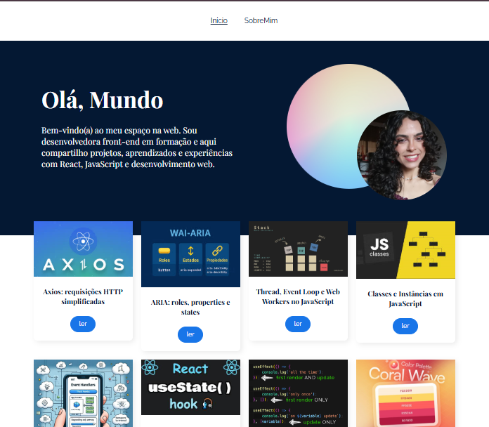

# Olá Mundo!


O **Olá Mundo** é um blog pessoal com navegação dinâmica entre páginas e posts técnicos, baseado em um layout do Figma.

Desenvolvido do zero, o projeto aplica conceitos centrais do **React Router** — como rotas aninhadas, navegação sem recarregamento e organização modular — resultando em uma estrutura legível, reutilizável e fácil de manter, com foco na experiência do usuário.

Na página inicial, o visitante encontra uma breve apresentação e uma lista de artigos sobre JavaScript, React e desenvolvimento web. Cada post possui uma página própria acessada dinamicamente, proporcionando leitura fluida e organizada. A página **Sobre mim** apresenta minha trajetória e objetivos profissionais, enquanto a página **404** personalizada orienta o usuário quando uma rota não é encontrada, preservando a consistência da navegação. A interface clara e responsiva prioriza acessibilidade, usabilidade e compreensão imediata das informações.

Este repositório reúne **minhas contribuições técnicas e aprendizados**, evidenciando decisões de arquitetura, padrões adotados e a evolução do código ao longo do desenvolvimento.

## Minhas Contribuições

- **Arquitetura e organização:** Estruturação da aplicação adotando imports absolutos com alias `@` para melhor organização e escalabilidade, além de aplicar `CSS Modules` para isolamento e previsibilidade dos estilos.

- **Navegação com React Router:** Implementação de rotas estáticas e dinâmicas para páginas e posts, indicação de rotas ativas utilizando componentes e hooks nativos, e criação de uma página 404 personalizada para tratamento de rotas inexistentes.

- **Componentização da interface:** Desenvolvimento de componentes funcionais reutilizáveis, seguindo princípios de separação de responsabilidades e composição do React.

- **Renderização dinâmica de conteúdo:** Listagem e exibição de posts por rotas dinâmicas com `react-markdown`, permitindo estruturar conteúdos técnicos de forma escalável e organizada.

- **Experiência de navegação:** Implementação de lógica de **ScrollToTop** para restaurar o topo da página a cada navegação e criação de uma seção de posts recomendados, incentivando a continuidade da leitura.

- **Boas práticas e bibliotecas auxiliares:** Integração de soluções que melhoram produtividade e experiência do usuário, mantendo o código desacoplado e alinhado ao ecossistema React.

  <p align="center">
  
  
</p>

## Tecnologias Utilizadas

- HTML5
- CSS3
- JavaScript (ES6+)
- Vite
- React
- React Router DOM
- npm (gerenciamento de dependências)

⚙️ Técnicas aplicadas:

- **Roteamento com React Router:** uso de `Routes`, `Route` e `Outlet` para estruturar a aplicação como SPA com rotas aninhadas e navegação sem recarregamento.

- **Hooks de navegação e parâmetros:** utilização de `useNavigate` para controle de fluxo, `useParams` para leitura dinâmica das rotas e `useLocation` para restaurar o topo da página durante a navegação.

- **Componentização e composição no React:** construção de componentes reutilizáveis e desacoplados, facilitando manutenção e escalabilidade.

- **Renderização dinâmica de conteúdo:** exibição de artigos por rotas dinâmicas e estruturação do conteúdo com Markdown.

- **Estilização modular:** aplicação de CSS Modules para isolamento de estilos e maior previsibilidade visual.

- **Build e Escalabilidade:** Configuração com Vite, aproveitando inicialização rápida, suporte nativo a módulos ES e estrutura otimizada para evolução do projeto.

O projeto também incorpora boas práticas já refletidas nas contribuições, como tratamento de rotas inexistentes, organização com imports absolutos, estrutura semântica voltada à acessibilidade e melhorias na experiência de navegação para leitura contínua e fluida.

## Como Ter Acesso ao Projeto

- **Versão online**: [Clique aqui](https://ola-mundo-xi-seven.vercel.app/)
- **Rodar localmente**:

1. Clone este repositório: ```bash
   git clone https://github.com/chiquinelli-bia/ola-mundo.git

   ```

   ```

2. Acesse a pasta do projeto:

   ```bash
   cd ola-mundo

   ```

3. Instale as dependências:

   ```bash
   npm install

   ```

4. Inicie o servidor de desenvolvimento:

   ```bash
   npm run dev

   ```

5. Abra no navegador o endereço exibido no terminal e Navegue pelas funcionalidades implementadas.

## Créditos

- Projeto original: 
- Instrutor(es) e curso: Antônio Evaldo,  - Este repositório destaca **apenas minhas contribuições** ao projeto
